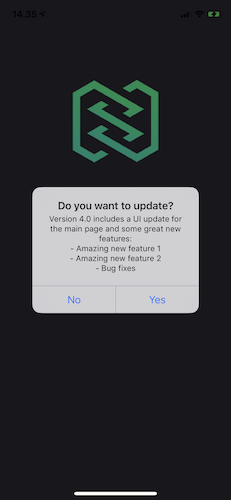
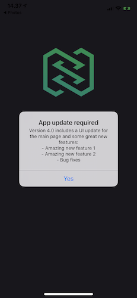
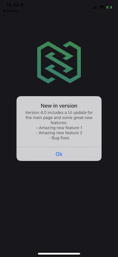
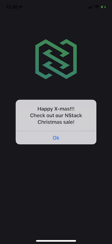

# Features
* [Introduction](#introduction)
* [Content](#content)
	* [Localize](#localize)
	* [Responses](#responses)
	* [Collections](#collections)
	* [Files](#files)
* [Notify User](#notify-user)
	* [Version control](#version-control)
	* [Messages](#messages) 
	* [Rate reminder](#rate-reminders)
* [Geographic](#geographic)
	* [Continents](#continents)
	* [Countries](#countries)
	* [Time zones](#time-zones)
	* [Languages](#languages)
	* [IP's](#ips)
* [Misc](#misc)
	* [UGC: Push logs](#ugc-push-logs) 
	* [UGC: Feedback](#ugc-feedback)
	* [UGC: Results](#ugc-results)
	* [Validators](#validators)
		*  [Phone number](#phone-number)
		*  [Email](#email)

## Introduction
This document describes what features are available in NStack and what use cases they can be used for. Use this as a reference when you are not sure what a certain feature can be used for or if you want to refresh you mind on what amazing things NStack can do.

NStack includes many features that facilitate and speed up development and project management and we should try to use it to its fullest. Don't reinvent the wheel!

## Content
### Localize
Localize is the most used feature of NStack and can/**should** be used **in all apps**.  
Localize is a way to **manage** all the **text** on all the platforms, it manages **translations** and allows you to **update text** on apps **without** having to **release** a **new version**.  
This way the PM or the client can change any text in the project straight from the NStack website.

**Use cases:**

* Button titles
* Screen titles
* Base urls (Useful when the backend is not stable yet or the app is working with a beta api for the time being)
* URLs for terms of service
* ...

### Responses
The responses feature is very **versatile** and can be used as an **alternative** for **custom API's** for simple apps/websites that mainly use **static content**.  
Using Responses(and collections) can **replace** a simple **API** and can **save** hundreds of hours of development time on the right project.

Using responses for static content can save many hours when the client wants to change some of that content, instead of having a developer change all the hard coded content and make a new build and have QA release it, the client/PM can change the content themself in NStack. No new build needed, no developer or QA time needed.

**Use cases:**

* Store static content
* Store default configurations
* ...

### Collections
The collection feature can be seen as a **more structured** version of the **responses** feature, and in turn is also very **versatile** and a good **alternative** for **custom API's** for simple apps/websites.

In the collection feature you can **define** a **template** (e.g.: A Product which has a title, description and price), using this model you can **add collections** and **single** Products to be stored.

An **example** could be:

You have defined you **"Product"** template, a product should have a **title**, **description** and **price**.  
Using this template you can setup certain **collections**:

* All products
* Available products
* Products on sale

But you can also define a **single** product based on the **template**, an example for that could be "Product of the day", "Most popular product", ...

A generic product is just **1 example** of what the collections could be used for and you can of course use **more templates** at the **same time**.  
On the **right project** with the **right planning** this feature can be very **powerful**. 

**Use cases:**

* Store a list of All product/articles
* Store a list of available products/ articles
* Feature the "Product of the day" 
* Store an apps default configuration along with some premade configurations 
* ...

### Files
The files feature allows you to **store** all kinds of **files** (images, pdf's, ...) that can then be easily retrieved by anyone with the required access.  
This can be very useful to host **static images** like backgrounds or header images.
The files are accessible through **URL** so this can be used on **any platform**.

**Access settings:**

* Private options:
	* "Password protected" - Requires a **password** to view the file.
	* "Login protected" - Requires the user to **login** and have **access** to the application to view the file.
* Public options:
	* "CDN" - The file is cached and can be **loaded faster** with options (width, height). But the file **cannot be deleted fast**.
	* "Web server" - The file is served via web server, it is **slower** that CDN but can be **deleted fast**.

**Use cases:**

* Background image
* Header image
* PDF file with terms of service
* ...

## Notify user
All of the following features can be active at the same time so they can conflict with each other. To not disturb the user only 1 message will be shown per app open.  
The priority for each popup will be as follows:

**iOS:**

1. Update alert
2. Whats new alert
3. Message
4. Rate reminder

**Android:**

(TODO: Check order on Android SDK)

### Version control
(TODO: Add android screenshots)

Using the version control feature of NStack you can inform the user that a **new version** of the app is **available**.  
There are a few ways you can configure how the user should interact and be informed about the new version:

**Update mode:**

* "Off" - The user will **not** be prompted with the update dialog.
* "On" - The user will be prompted with the update dialog on app open. But can **decide** to say no to the update, 24h later they will see the dialog again.
	* When selecting "Yes" the **App Store** will be opened on the apps page where the user can **update** the app.
	* When selecting "No" the dialog will be **dismissed** and the app resumes as normal.
	
	
	

* "Force" - The user will be prompted with the update dialog on app open, Which they **cannot close**. They are forced to update the app.
	* When selecting "Yes" the **App store** updates screen will be opened.
	
	

**New in version:**

* "Yes" - If the app has been **auto-updated**, we will show a dialog with the **change log** on the next app open.  
	

* "No" - No dialog will be shown after an auto-update.

**Change log:**

In the change log you can list all the **new features**, bug fixes or UI updates that are present in the new app and need to be presented to the user.

**File(Android):**

You can upload a file to the new version, this is mainly used when **releasing** an Android app **outside** of the **Google play** store using a .apk file.

**Text:**

The title and button texts used in the popups can be configured in the **localisation** section of the app on the **"Nstack(system)" platform**.

### Messages
Using the Messages feature of NStack can be a great tool for **informing your user** about technical difficulties, new sales or actions, etc.
This message is shown to the user **on app launch**.
You can configure how often the user will see the message, currently 2 options are available:

* "Show always" - Shows the message on **very** app launch
* "Show once" - Shows the message **once** on app launch and will not be shown again after the user presses "OK".  
(TODO: Add android screenshots)  
	

### Rate reminders
Rate reminders ask the user to **rate** the app on the platform specific **store**.  
You can currently only configure the rate reminder based on the amount of times the user has **opened** the **app**.
The popup is shown **on app launch** when the required amount of app openings has been met.

**iOS**

On iOS this is done by showing Apple's build in rating popup.  
*"You should be aware that the prompt will only be displayed to a user a maximum of **three** times within a **365-day period**."* - [Apple docs](https://developer.apple.com/documentation/storekit/skstorereviewcontroller/requesting_app_store_reviews)

**Android**

(TODO: Check on Android/ add screenshot) Not implemented?

## Geographic
**Note: The following datasets are global, meaning changing it in 1 project will change it for all projects.**

Encourage the developers to use these datasets in appropriate use cases, these datasets discourage hardcoding this data in the app or using a 3rd party datasets/libraries.
It also gives us more flexibility to update the data without a new app release should something change.

### Continents
The continents dataset includes the 7 continents, for each continent the following properties are available:

* Name
* Code
* Image

**Use cases:**

* Show list of continents for the user to pick from.
* Use images as markers on a map.
* ...

### Countries
The countries dataset includes around 250 countries, for each country the following properties are available:

* Country code
* ISO code
* 2 images
* English Name
* Native name
* Continent
* Capital
* Capital timezone
* Coordinates for the capital
* Phone number prefix
* Currency
* Languages

**Use cases:**

* Show list of countries for the user to pick from
* See what currency is used in a certain country
* Check what timezone a certain county uses
* Get the coordinates from a certain country's capital
* ...

### Time zones
The timezones dataset includes over 500 timezones, for each timezone the following properties are available:

* Name
* Abbreviation
* Offset from UTC in seconds
* A standardised text used in the UTC notation (e.g.: UTC+5)

**Use cases:**

* Show a list of timezones for the user to pick from.
* Check the offset from UTC for a certain timezone
* ...

*Notes:*

* *As there are so many timezones using this as a reference might a bit overkill.*
* *Many languages/platform have a build in way of handling/Referencing timezones, discuss with the developer what is needed/possible.*

### Languages
The languages dataset includes over 50 languages, for each language the following properties are available:

* Name
* Locale ( [language abbreviation] - [area] e.g.: en-Gb, en-US. Both english but different areas )
* Reading direction

**Use cases:**

* Show a list of languages
* ...

### IP's
The enormous IP dataset includes over 10 million IPs, for each IP range the following properties are available: 

* Start of range
* End of range
* Country
* State
* City
* Location coordinates
* Timezone
* ISP
* Type

**Use cases:**

* Use as a fallback when the user denied the location permissions
Using this dataset as a reference we can see in what area the user is without relying on the device.
This is useful in cases where the location of the user doesn't need to be accurate, where just a city is accurate enough.  
**Warning: This is not 100% accurate, When traveling a IP address of the users home country can still be in use.**
* ...

## Misc
### UGC: Push logs
The push logs features allows the **backend** responsible for sending out push notifications to **log** all the **notifications** it sends out.  
These logs can be seen on the NStack website and can be **easily sorted**.

These logs can be very **useful** if anything goes wrong in in terms of push notifications, this is traditionally **very hard to debug** and figure out what went wrong, with these logs we should have a better idea on what was send and if it succeeded or not and can **save many hours debugging**.

The logs include:

* Push provider (e.g.: Firebase, urban-airship)
* Key: App key in fcm/ urban-airship
* Message: included in the push notification
* Succeeded: if the push was sent or not
* Type (e.g: standard, friend-request, taxi-arrived)
* UserID: The user ID used by the project
* Relation: Similar to type but more general (e.g.: Booking, Company, ...)

### UGC: Feedback
The feedback feature is a very useful for **collecting** user **feedback** in **one place** that is easily accessible.
This can be used to include a "Send us feedback" section in the settings screen of the project.
Using the feedback feature the user can send feedback with the following properties:

* Operating system (iOS, Android, web)
* App version
* Device
* Name of user
* Email of user
* Message
* An image

When you have collected some feedback from users you have the following feature

* Assign a person
* Set a status (options: Created, Assigned, Progress, Done and Skipped)

### UGC: Results
The results feature was originally used to aggregate the results of a survey but can be used to collect any kind of question answers.
Alongside collecting the result, on the NStack website you can see a nice overview of all the results and even see them in graphs.

The results include the following properties:

* Key: Can be used as the question but can be given any value.
* User: Name or id of the user sending the result.
* Answer: The answer given to a certain question.
* Points: If can be used if the answer has a numeric value and a text value.
* Tag: Any tags you would want to include.

**Use cases:**

* Surveys
* Periodic questions
* ...

### Validators
#### Phone number
The phone number validator **validates** if a given phone number has the **right amount of digits** according to the **origin countries** standard.
#### Email
The email validator is not only a **validator** for the **structure** of the email address, but also checks for **common mistakes** (e.g.: typing .con instead .com) and can return a warning if there seems to be a common mistake. 
