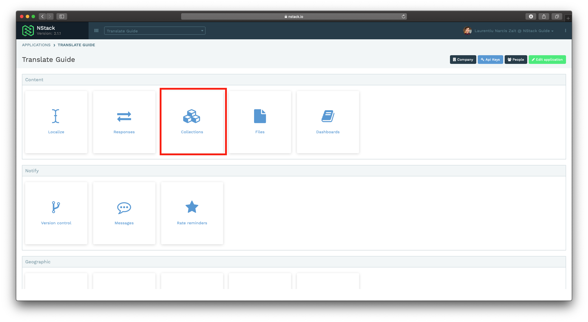
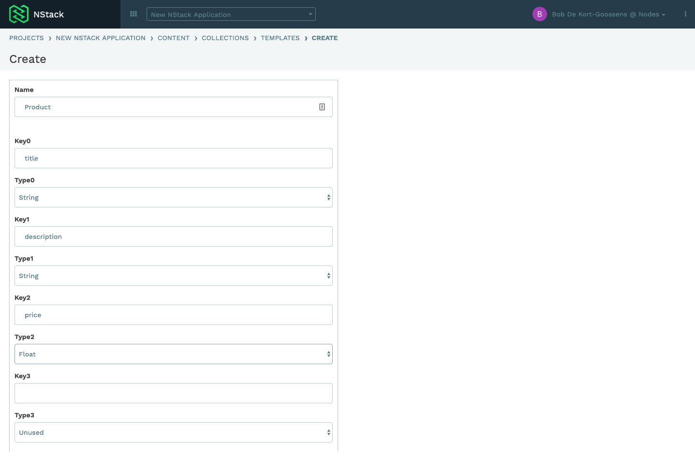
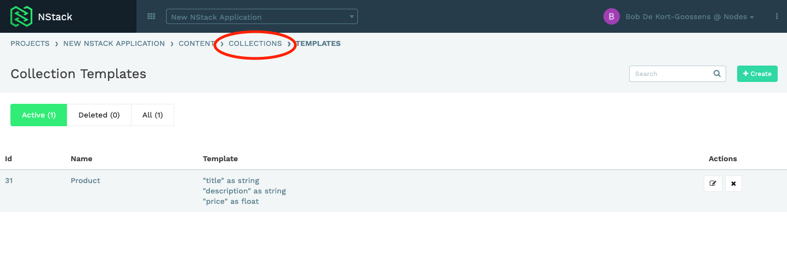
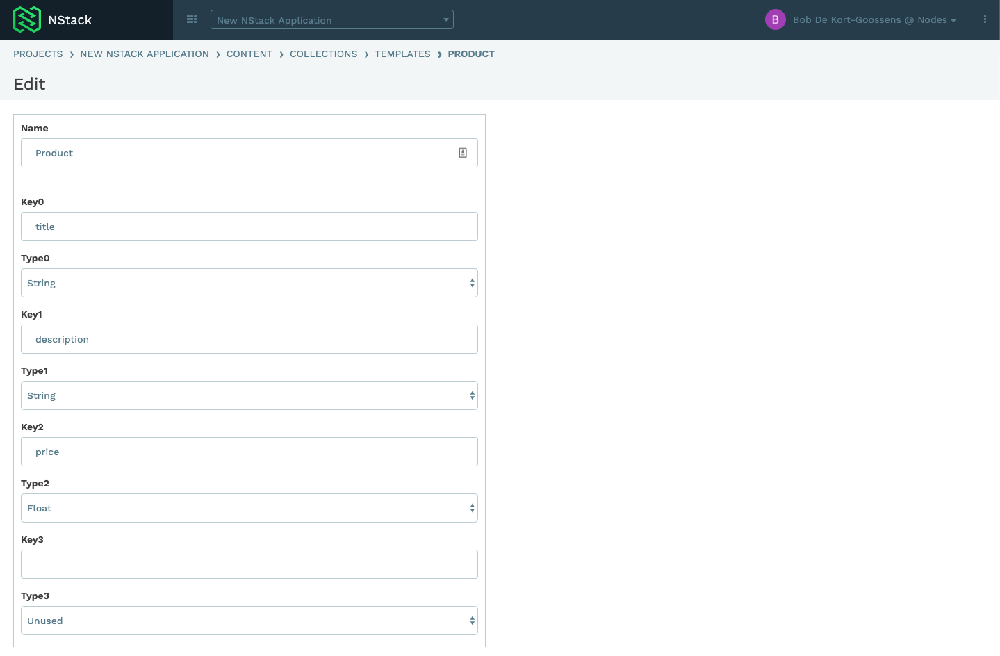
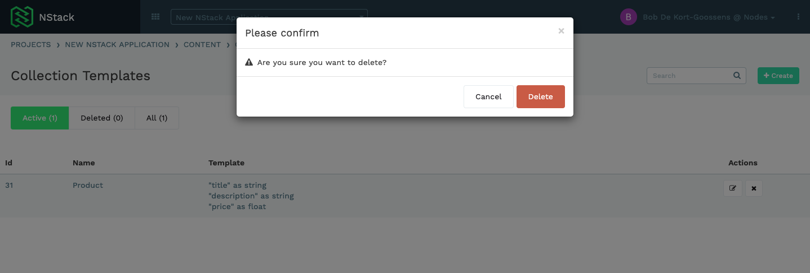
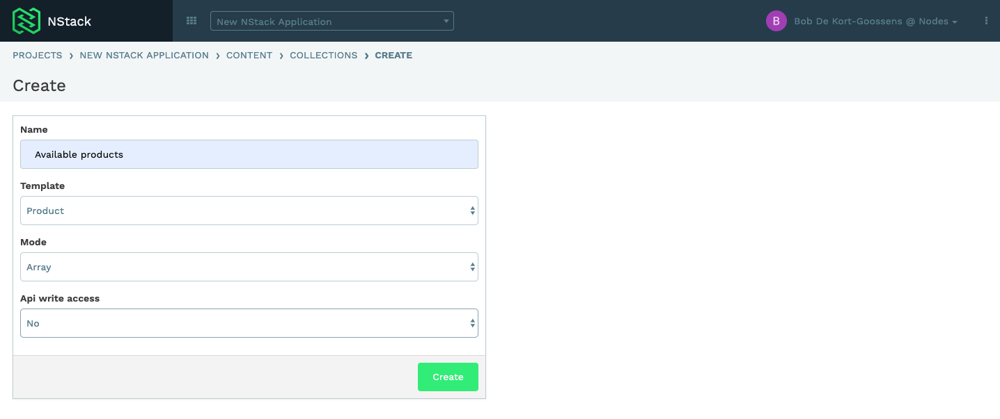
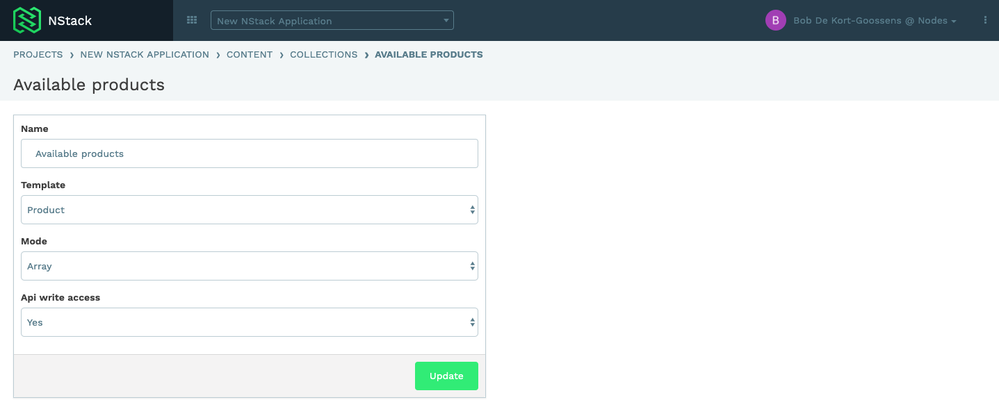
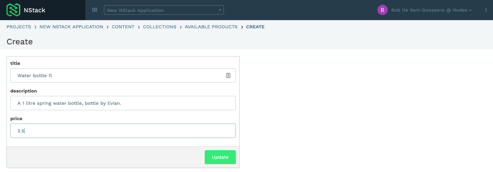
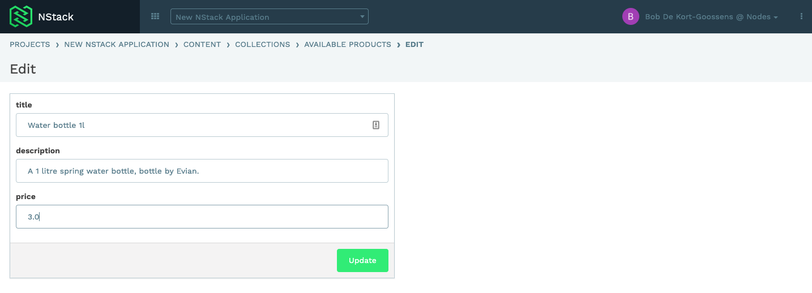

# NStack Guide - Collections

* [Overview](#overview)
	* [System overview](#system-overview)
	* [Guide overview](#guide-overview)
* [Accessing the collections system](#accessing-the-collections-system)
* [Templates](#templates)
	* [Creating a template](#creating-a-template)
	* [Modifying a template](#modifying-a-template)
	* [Deleting a template](#deleting-a-template)
* [Collections](#collections)
	* [Creating a collection](#creating-a-collection)
	* [Modifying a collection](#modifying-a-collection)
	* [Deleting a collection](#deleting-a-collection)
* [Objects](#objects)
	* [Creating an object](#creating-an-object)
	* [Modifying an object](#modifying-an-object)
	* [Deleting an object](#deleting-an-object)
	* [Change order of an object](#change-order-of-an-object) 

## Overview
### System overview

The purpose of the Collections feature in NStack is to enable you, as a client, to be able to control different data sets that are shown in the app. As the Collections feature is very versatile the usage of it depends in what it is used for in the app. The system is hosted on Nodes servers, and you gain access to the system by havnig a Nodes employee inviting you via email.
See the [Getting started](getting-started.html) guide for more info on accessing NStack.

### Guide overview

The purpose of this guide is to present the Collections feature of NStack and one of it's possible use cases. The guide does not cover any other aspects of NStack, for information on other features or more use cases for collections, refer to the [feature overview](../../features/collections.html).

## Accessing the Collections system

After logging in, assuming you have just one project, you will be presented with the following screen. If you have access to multiple projects, you'll have to select a project first. Press the "Collections" button to access the Collections feature of NStack.

 {.screenshot}

## Templates

How you use the Collections feature is all based on what templates you have defined.

### Creating a template

To create a new template press the ">Templates" button on the top right.

On the next page select the "Create" button to define a new template.

On this page you can define your template, give the template a name and define up to 30 keys with their value type for this template.
Once you are happy with your template scroll to the bottom of the page and press the "Create" button.

You will see your new template on the template overview, to use your new template navigate back to the collections over view by pressing "collections" in the navigator.

### Modifying a template

To modify a template go to the template overview by pressing the ">Templates" button on the Collections overview.

Press the "Pencil" button on the template you want to modify.

Make your changes on this page, when you are happy with the changes scroll down to the bottom of the page and press the "Update" button.

### Deleting a template

To deleta a template go to the template overview by pressing the ">Templates" button on the Collections overview.

Press the "Cross" button on the template you want to delete.

If you are sure you want to delete the template press the "Delete" button on the popup.

## Collections
### Creating a collection

To create a new collection press the "Create" button on the collections overview.

Give your collection a name, assign a template, set it's mode and tell NStack if the collection can be changed using the api or not.
Press the "Create" button when you are ready.

Now that you have created a collection you can start adding objects to it.

### Modifying a collection

To modify a collection press the "Pencil" button on the collection you want to modify.

Make the changes you need to change and press the "Update" button when you are ready.

### Deleting a collection

To delete a collection press the "Cross" button on the collection you want to delete.

If you are sure you want to delete this collection press the "Delete" button on the popup.

## Objects
### Creating an object

To create an object and add it to a collection press the "eye" button on the collection you want to add it to.

Press the "Create" button to add an object to the colletion.

Fill out the values you have previously defined in your template.
And press the "Update" button when you are done.

You will see that the object you just added is listed in the collection.

### Modifying an object

To modify an object navigate to the collection by pressing the "Eye" button on the colletion overview.

After that Press the "Pencil" button on the object you want to modify.

Make your changes and when you are ready press the "Update" button.

### Deleting an object

First navigate to the collection that contains the object by pressing the "Eye" button on the collection that contains the object.

Then press the "Cross" button on the object you want to delete. 

If you are sure you want to delete this object press the "Delete" button on the object.

### Change order of an object

To change the order of object first navigate to the collection that contains the objects by pressing its "Eye" button.

Then use the "Up arrow" and "Down arrow" to reorder the objects.

