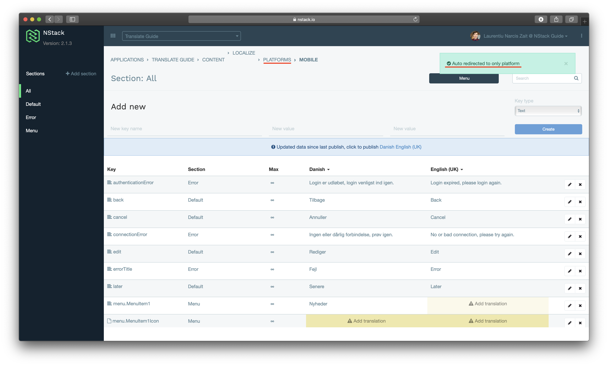
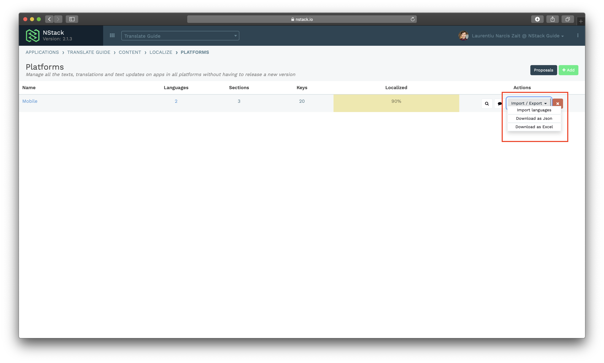

# Export localizations

The `NStack web console` offers the posibility to export the localization keys that are on NStack in an `.xlsx` or `.json` file format.

The exportation of localizations can be useful if someone would like to work offline on the translations or they find it much easier to have the localizations in Excel, where they can have an overview. The exported document contains all the defined languages for that application.

To access the `Export localizations` feature, you have to go to the `Localize` option from the app overview

 {.screenshot}

As it can be seen in the screenshot, this particular app has only one platform defined - `Mobile` . You will need to press on `Platforms`

> If there are more platforms defined for the application, then all the platforms are listed in this step.

 {.screenshot}

When the `Platforms` screen is shown, for each platform, there is a button, under `Actions` called `Import/Export` and when you click on it you will be presented with 3 options:

* `Import languages`
* `Download as Json`
* `Download as Excel`

 {.screenshot}