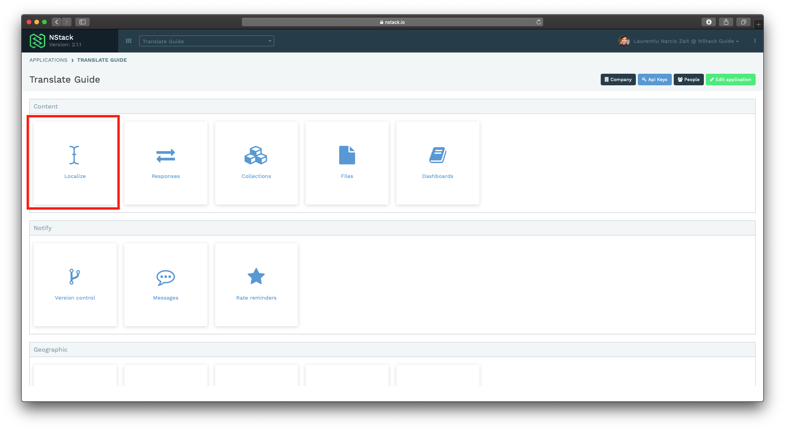
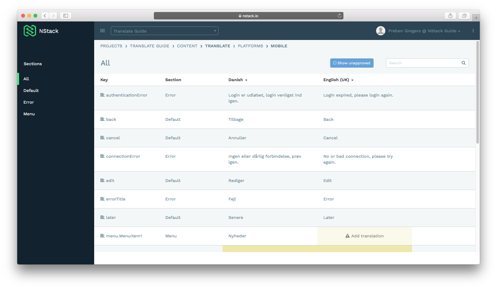
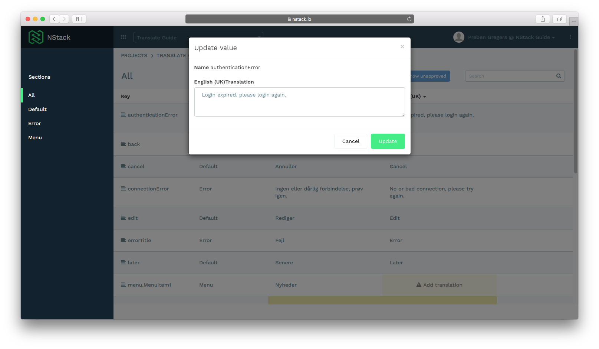

# NStack Guide - Localize for Beginners

* [Overview](#overview)	
	* [System overview](#system-overview)
	* [Guide overview](#guide-overview) 
* [Getting started](#getting-started)
	* [Accessing NStack](#accessing-nstack) 
* [Accessing the Translate system](#accessing-the-translate-system) 
* [Editing values](#editing-values)
	* [Editing a value](#editing-a-value)
* [Translation example](#translation-example)

## Overview
### System overview

The purpose of the Localize feature in NStack is to enable you, as a client, to be able to control all text values in your app. The system is easily extendible, and allows you to maintain multiple languages for your app in one place. The system is hosted on Nodes servers, and you gain access to the system by having a Nodes employee inviting you via email.

### Guide overview

The purpose of this guide is to present how you log in and how to access the translation feature “Translate” of NStack. The guide does not cover any other aspects of the NStack.

NStack is designed to store text values for multiple apps, with multiple platforms and multiple languages. Platforms in NStack are representations of the different parts of an app that make up the app ecosystem, typically being web, mobile and backend. The mobile platform contains text values that are used mainly by the app, the backend contains values that are used solely by the backend, e.g. push notifications text, and the web platform stores values that are used on a website, if any.

## Getting started
### Accessing NStack

See the [Getting started](../docs/guides/getting-started.html) guide for information on how to access NStack.

## Accessing the Localize system

After logging in, assuming you have just one project, you will be presented with the following screen. If you have access to multiple projects, you’ll have to select a project first. Press the “Localize” button to access the translation feature of NStack.

 {.screenshot}

## Editing values

To edit translations for a language, press the Magnifying Glass icon on the platform you wish to edit. Clicking the magnifying glass icon will present you with a screen showing all translations for the app. NStack creates some default values out of the box, mostly error messages and user notifications. These values are present in all projects, and the keys should not be changed.

 {.screenshot}

On the left side if the screen, a list of current sections are listed, and on the right side, all translation values stored in the section are listed. The section “All” contains all translations, regardless of what section they belong to.

 {.screenshot}

### Editing a value

To edit a value, press the row containing the value you want to edit. Do not press the pencil icon, as that edits the key, which could end up hindering the apps access to that key, as the app refers to the key to extract the value from NStack. Press “Update” when you are satisfied with your edit.

 {.screenshot}

Edited values does not immediately take effect in the app, but is read next time the app is restarted. To force a refresh of the translation values, restart the app.

## Translation example

The following shows an example of an in-app screen, with some of the corresponding values in NStack. Changing the values in NStack will change the value in the app.

