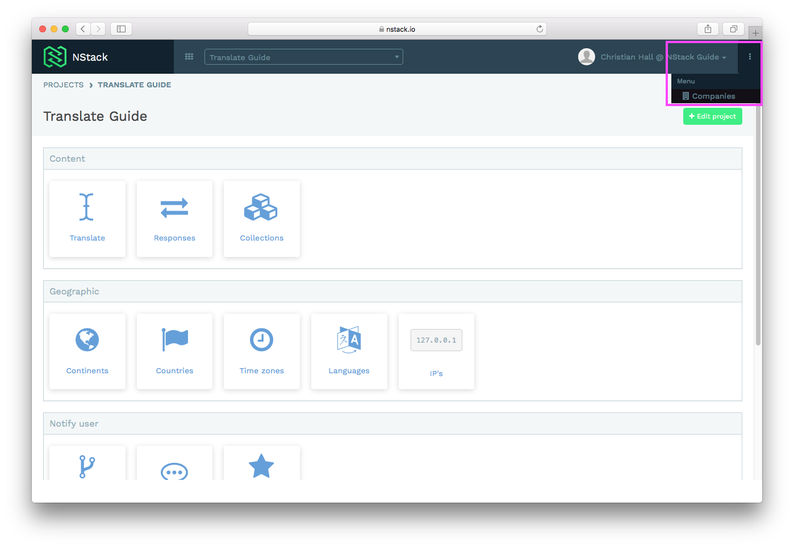
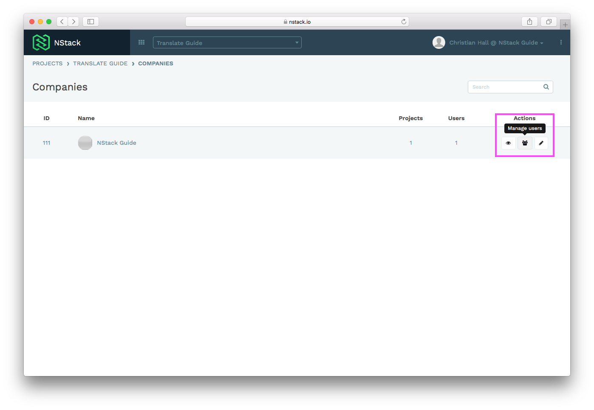
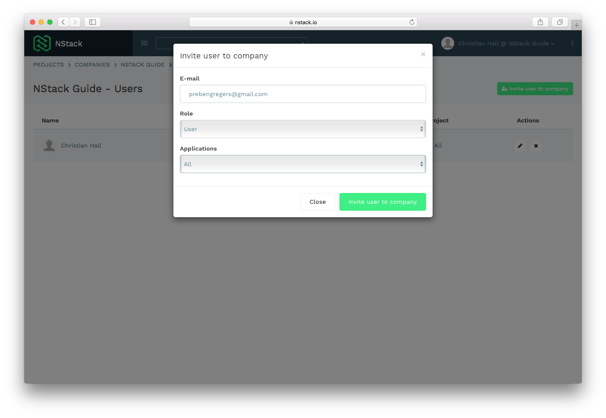
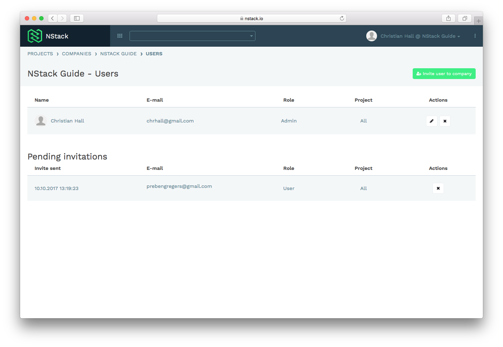

# NStack guide - User management

* [Overview](#overview)
	* [System overview](#system-overview)
	* [Guide overview](#guide-overview)
* [Getting started](#getting-started)
	* [Accessing NStack](#accessing-nstack)
* [User management](#user-management)
	* [Accessing user management](#accessing-user-management)
	* [Creating users](#creating-users)
	* [Editing users](#editing-users)
	* [Deleting users](#deleting-users)

## Overview
### System overview

The purpose of NStack is to enable you, as a client, to be able to control all text values in your app. The system is easily expandable, and allows you to maintain multiple languages for your app in one place. The system is hosted on Nodes servers, and you gain access to the system by having a Nodes employee inviting you via email.

### Guide overview

The purpose of this guide is solely to present the user management feature of NStack. The guide does not cover any other aspects of the NStack. Information on how to use the system to update text values in your app, can be found in the NStack Guide that covers the translation part of the system.

In NStack, users belong to companies. On top of showing you how to access NStack, this guide will show you how to add additional users to an existing company, and also show you how to edit and delete those users. User management require administrative privileges.

## Getting started
### Accessing NStack

See the [Getting started](/docs/guides/getting-started.html) guide for information on how to access NStack.

## User management
### Accessing user management

To manage users, you will have to add them to your company. This is done by accessing the menu via the three dots in the upper right corner. Click “Companies” to see a list of companies you have access to. Usually there will be only one company in this list. 

To manage the users of that company, press the user icon.

### Creating users

If you wish to create a new user, click the green “Invite User to Company” button, and fill out the form that pops up with the user's email.

#### User Roles

Users can either be Administrators or Users. Users do not have access to the user management features of NStack, and should be the default choice when adding users to the platform.

#### Applications

Users can be granted access to specific applications if needed, instead of all your applications, which is the standard setting.

Ensure that the form is filled out correctly, and submit the form by pressing “Invite User to Company”. The user will receive an email with an invitation to join NStack. Until the user has accepted the invitation, the user will be listed under pending invitations.

### Editing users

To edit a user, click the pencil icon in the row containing the user. You can edit the user role.

### Deleting users

To delete a user, click the cross icon in the row containing the user.

